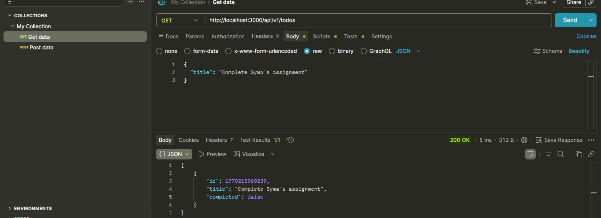
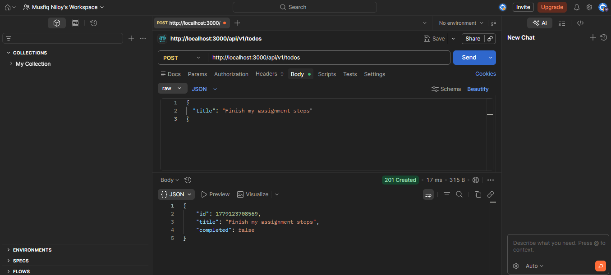
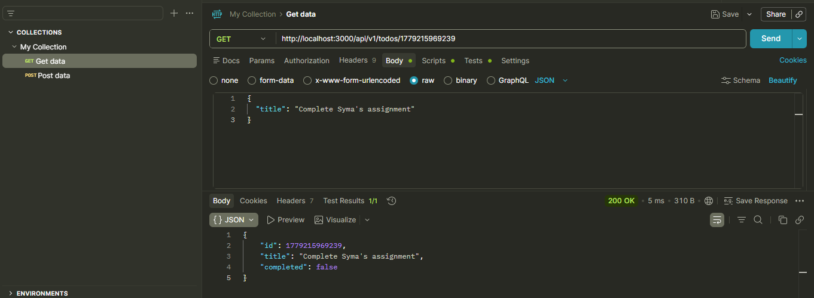
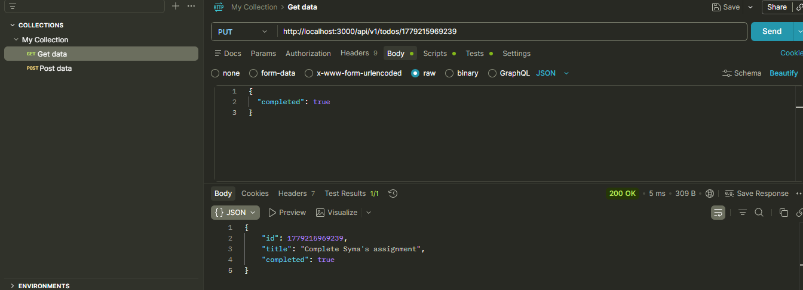
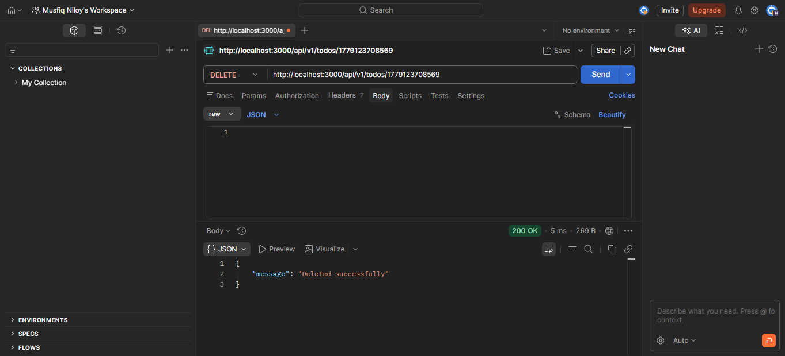

# 🎓 Student Profile & Todo Application API

## 📌 Overview

This project is developed as part of the IT Project Management course.  
It demonstrates how to build a complete REST API using Node.js and Express.js.

---

## 🚀 Features

- Custom API route for student profile
- Complete CRUD API endpoints for a Todo application
- JSON formatted responses
- Fully tested using Postman

---

## 🔗 API Endpoints

### 1. Student Profile Routes

- **GET** `/api/v1/student-profile` - Get student profile details
- **GET** `/api/v1/status` - Check server status

### 2. Todo Application Routes (New Assignment)

- **GET** `/api/v1/todos` - Get all todos
- **POST** `/api/v1/todos` - Create a new todo
- **GET** `/api/v1/todos/:id` - Get a selective todo by ID
- **PUT** `/api/v1/todos/:id` - Update a todo's title or completion status
- **DELETE** `/api/v1/todos/:id` - Delete a todo by ID

---

## 📊 Sample Student Profile Response

```json
{
  "status": "success",
  "student": {
    "studentId": "232031037",
    "fullName": "Musfiq Niloy"
  }
}
```

## 📷 Postman API Testing Results

### 1. Get All Todos



### 2. Create Todo



### 3. Get Selective Todo



### 4. Update Todo



### 5. Delete Todo


